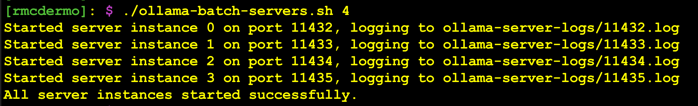
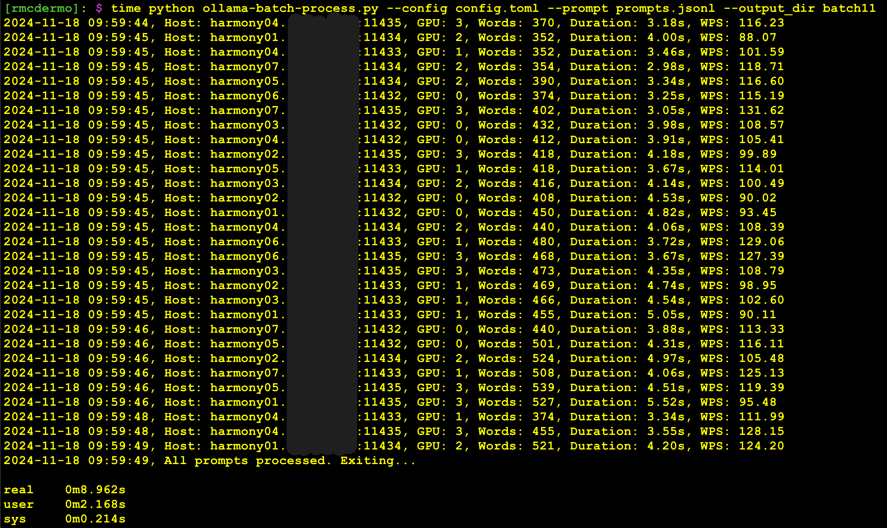

# Ollama Batch Cluster

The code in this repository will allow you to batch process a large number of LLM prompts across one or more Ollama servers concurrently and centrally collect all the responses. 

This project started after I tried to get Ollama to make full use of a system with four Nvidia L40S GPUs but failed. I adjusted the *OLLAMA_NUM_PARALLEL* and *OLLAMA_SCHED_SPREAD* environment variables, and while it was now using all four GPUs, it was only pushing each GPU to about 25% utilization, so it didn't run any faster than if I had only had one GPU. I then ran four independent Ollama servers, each one pinned to different GPU using the *CUDA_VISIBLE_DEVICES* variable, and created a script to load balance prompts across the Ollama servers and GPUs. After a bunch of testing and refinement I ended up with the system I've shared in this repo. For a larger test, I spun up Ollama servers on six more servers, each with 4 L40S GPUs for a total of 28 GPUs and 1.344TB of VRAM. It worked perfectly. I know that vLLM is probably a better option for performance than Ollama, but I really like Ollama and it makes this very simple. I'll be spending more time with vLLM soon. I as able to use this setup to keep all 28 GPUs over 90% utilized for over 24 hours to stress test new GPUs before they went into production (one GPU kept failing with double bit errors and needed to be replaced).

The following sections will show you how to use the code in this repo to set this up and use it to run batch jobs against any number of GPUs/servers.

These instructions assume that you are already know how to install/use Ollama, are familiar with editing files, and running scripts. If you are new to Ollama and what to learn how to use it, see [my article](https://medium.com/p/913e50d6b7f0/) which covers the basics. 

## Starting the Ollama servers

The first thing we'll need to do is start up the Ollama servers, one per GPU. If you only have one GPU, or one GPU per multiple servers, and Ollama is already running, you probably don't need to this. To start the Ollama servers, one per GPU, we are going to use the provided [*ollama-batch-servers.sh*](https://github.com/robert-mcdermott/ollama-batch-cluster/blob/main/ollama-batch-servers.sh) shell script. It takes a single integer argument which indicates the number of GPUs in the system you want to use.

**Usage:**

```bash
chmod +x ollama-batch-servers
./ollama-batch-servers.sh <number of gpus>
```

**Example on a system with 4 GPUs**:



## Preparing your prompts

Next, you'll need to create a *JSONL* formatted file, with a single prompt per line. The following is an example:

```JSON
{"role": "user", "content": "Analyze the reasons behind the collapse of the Western Roman Empire."}
{"role": "user", "content": "How did Roman architecture influence urban development in Europe?"}
{"role": "user", "content": "Compare and contrast the political systems of the Roman Republic and the Roman Empire."}
{"role": "user", "content": "Discuss the role of religion in the daily life of Roman citizens and its impact on the Empire."}
{"role": "user", "content": "Evaluate the effects of Roman conquest on the cultures of the conquered territories."}
{"role": "user", "content": "How did the Roman Empire maintain control over such a vast territory?"}
{"role": "user", "content": "Examine the relationship between the Roman Senate and the Emperor."}
{"role": "user", "content": "What technological innovations did the Romans contribute to modern society?"}
{"role": "user", "content": "Analyze the role of the Roman economy in sustaining the empire’s growth and stability."}
{"role": "user", "content": "Describe the causes and consequences of the Roman Empire's split into Eastern and Western regions."}
```

## Configuring the batch client

The configuration file is a TOML formatted file that includes the LLM model to use, the list of Ollama instances to run the prompts against, and the system message to provide the LLM that will determine how it responds to the prompts. Here is an example configuration file for a setup with 4 servers, each with 2 GPUs:

```TOML
model = "llama3.2"
system_message = """You are an alien that can only respond with strings of emoji characters to convey your answer."""

[ollama_instances]
#format: "hostname:port" = GPU index
"server1:11432" = 0
"server1:11433" = 1
"server2:11432" = 0
"server2:11433" = 1
"server3:11432" = 0
"server3:11433" = 1
"server4:11432" = 0
"server4:11433" = 1
```

If you are running this on your laptop with the single standard Ollama process running on the default port, your configuration file should look like this:

```TOML
model = "llama3.2"
system_message = """You are an alien that can only respond with strings of emoji characters to convey your answer."""

[ollama_instances]
"127.0.0.1:11434" = 0
```

## Running a batch job

Now that we have our servers running, prompts prepared and a configuration file, it's time to process the prompts across the cluster of hosts and GPUs. To do that we'll use the provided [*ollama-batch-process.py*](https://github.com/robert-mcdermott/ollama-batch-cluster/blob/main/response-printer.py). But first we'll need to install the required dependencies, the *ollama* and *toml* modules:

```bash
pip install ollama toml
```

The following is the usage documentation for the client:

```bash
usage: ollama-batch-process.py [-h] [--config CONFIG] --prompts PROMPTS [--output_dir OUTPUT_DIR]

Ollama Batch Processing Client

options:
  -h, --help            show this help message and exit
  --config CONFIG       Path to the configuration TOML file
  --prompts PROMPTS     Path to the JSONL file with prompts
  --output_dir OUTPUT_DIR
                        Directory to save the response JSON files
```

Example running submitting a batch or prompts for processing:



In the example below, over two minutes (121 seconds) of work for a single GPU was completed in just 9 seconds, which is 13.5x faster than if it was run serially on a single GPU. 

# Collecting the responses 

The responses from each prompt will be written to the designated output directory (or the 'responses' directory if an output directory name wasn't provided) in JSON format, with a file per prompt. The name of the files are the Unix epoch time followed by a random element to avoid collision (example: *1732121830-4358.json*). The output data files include the prompt and response pair.

Example output file contents:

```JSON
{
    "prompt": "Why is the sky blue?",
    "response": "The sky appears blue because molecules in Earth's atmosphere scatter shorter blue wavelengths of sunlight more than longer wavelengths like red."
}
```

If you what to combine all the responses into a single output, the provided [*response-printer.py*](https://github.com/robert-mcdermott/ollama-batch-cluster/blob/main/response-printer.py) script will merge the responses into a single output. 

Usage:

```
python response-printer <directory of response JSON files>
```

The following is an example of the combined responses using emoji output to keep it short:

```
########################################
# File: 1732088793-9394.json
########################################
Prompt:
Discuss the influence of Roman culture on the development of Western civilization.

Response:
🏯💫🔥📚💡👑🤴🏻💪🌎️🕊️👸💃🏻🕺😍

########################################
# File: 1732088814-4841.json
########################################
Prompt:
How did the Roman Empire maintain control over such a vast territory?

Response:
🏛️🔒💪🚣‍♂️🌄📜👑💼

########################################
# File: 1732121810-9808.json
########################################
Prompt:
How did the Roman legal system shape the foundation of modern law?

Response:
🏛️📜🔒👮‍♂️💼🕊️🚫👫🤝
```

# Batch Data Extraction

***Note: the clinical notes in this section are synthetic and contains no PII or PHI***

In the example above it just provided an unstructured text (emojis actually 😀), but you can also use this method to extract and combine structured data such as JSON out of a batch of unstructured inputs. In this example, we'll take a bunch of unstructured clinic visit notes, process them batch style across multiple GPUS (it would also work is a single GPU, just much slower) that will extract data into a defined data structure (defined in the system message located in the configuration file) which will result in a json file per clinic note in the designated directory. We'll then use a provided script to merge those data files into a single json document. The resulting data could be imported into database a records, or a parquet file in a data lake, etc.

All the files (input and example outputs) in this example are provided in the [data-extraction-example](https://github.com/robert-mcdermott/ollama-batch-cluster/tree/main/data-extraction-example) director of this repo.

**Configuration**

First we'll need to create our configuration file that provides a system prompt to tell the LLM how to behave and the resulting data structure we want to conform the extracted data to. In this example we are using the 32b version of [Qwen2.5](https://ollama.com/library/qwen2.5) model. This model is good at following instructions and handling JSON, use a smaller model as needed to fit the VRAM capacity of your GPUs 

***Config file:*** [clinical-notes-config.toml](https://github.com/robert-mcdermott/ollama-batch-cluster/blob/main/data-extraction-example/clinical-notes-config.toml)

```toml
model = "qwen2.5:32b"
system_message = """
Your task is to extract structured data from unstructured clinical notes. For each input, you must extract the following fields if present and respond only with a JSON object in the exact format below. Do not provide any other responses or comments.
{
  "mrn": "",
  "patient_name": "",
  "age": 0,
  "sex": "",
  "visit_date": "",
  "reason_for_visit": "",
  "diagnosis": "",
  "medications": []
}
If a field is not present in the input, leave it empty or as an empty array ("[]" for "medications").
Only respond with the JSON object, nothing else.
"""

# two servers, each with 2 L40S GPUs:
[ollama_instances]
"gpu-server1:11432" = 0
"gpu-server1:11433" = 1
"gpu-server2:11434" = 0
"gpu-server2:11435" = 1
```

**Data Preparation**

Next take your collection of data and put them in the required JSONL format. Below is a sample of the contents of the provided [clinical-notes.jsonl](https://github.com/robert-mcdermott/ollama-batch-cluster/blob/main/data-extraction-example/clinical-notes.jsonl) data file. 


```JSON
{"role": "user", "content": "Patient: John Doe (MRN: 123456), a 45-year-old male, visited the clinic on 03/15/2023 complaining of severe chest pain that started a few hours prior. He was diagnosed with angina following an ECG and blood tests. He was prescribed aspirin and nitroglycerin for management and advised to follow up in two weeks."}
{"role": "user", "content": "Visit on April 20, 2023. Jane Smith (MRN: 234567), 32 years old, presented with persistent and debilitating headaches that have been occurring for the past month. Reason for visit: chronic migraines. She was prescribed sumatriptan and advised on lifestyle modifications. Diagnosis confirmed as migraine after ruling out secondary causes."}
{"role": "user", "content": "Mark Johnson (MRN: 345678), male, age 50, came to the hospital on 02/02/2023 reporting shortness of breath and a persistent cough. Examination revealed signs consistent with COPD. Pulmonary function tests were ordered to confirm the diagnosis, and he was started on bronchodilators for symptom relief."}
{"role": "user", "content": "On June 5, 2023, Sarah Lopez (MRN: 456789), a 27-year-old female, visited for a routine checkup. She reported no specific complaints but requested birth control counseling. Reason: wellness exam. No new diagnosis was made, and no medications were prescribed during the visit."}
{"role": "user", "content": "Visit Date: 07/10/2023. Patient: Emily Zhang (MRN: 567890), a 40-year-old woman, presented with a three-day history of severe abdominal pain. A thorough examination suggested gastritis, and omeprazole was prescribed for acid suppression. She was advised to avoid spicy foods and alcohol."}
{"role": "user", "content": "Patient Henry Lee (MRN: 678901), a 65-year-old male, came to the clinic on 01/22/2023 for a follow-up on his long-standing hypertension. He reported good adherence to his medication regimen, which includes lisinopril. No new diagnosis was made, and his current treatment plan was continued."}
{"role": "user", "content": "Karen Davis (MRN: 789012), a 37-year-old woman, arrived on 10/14/2023 with complaints of a worsening skin rash over her arms and neck. On examination, she was diagnosed with contact dermatitis, likely due to a new detergent. Hydrocortisone cream was prescribed, and she was advised to avoid irritants."}
{"role": "user", "content": "Michael Brown (MRN: 890123), a 29-year-old male, was seen on May 8, 2023, with complaints of fever, fatigue, and body aches for the past three days. After ruling out bacterial infections, he was diagnosed with influenza. Medications: Tamiflu was prescribed, and hydration and rest were recommended."}
{"role": "user", "content": "Alice Taylor (MRN: 901234), a 47-year-old female, came on 03/30/2023 complaining of lower back pain that started after heavy lifting. Examination revealed muscle strain. She was advised to take ibuprofen and start physical therapy. No red flags for other conditions were noted."}
{"role": "user", "content": "David Wilson (MRN: 112345), a 55-year-old man, visited on 09/09/2023 for his annual physical exam. He had no specific complaints and no significant changes in his medical history. Routine labs were ordered, and no new medications were initiated. He was encouraged to maintain his healthy lifestyle."}
{"role": "user", "content": "Lucy Carter (MRN: 223456), a 24-year-old female, presented on August 1, 2023, with complaints of anxiety that has been interfering with her daily life. She was diagnosed with generalized anxiety disorder (GAD) and prescribed sertraline. She was also referred to a counselor for therapy."}
{"role": "user", "content": "On 06/18/2023, Thomas Moore (MRN: 334567), a 72-year-old male, visited for worsening shortness of breath over the past week. A thorough workup revealed heart failure, and he was started on furosemide and carvedilol. Follow-up was scheduled to monitor his response to treatment."}
{"role": "user", "content": "Jennifer Scott (MRN: 445678), a 36-year-old woman, attended on 02/12/2023 complaining of nausea and vomiting lasting two days. Diagnosis: viral gastroenteritis. She was advised to maintain hydration and rest. No specific medications were prescribed as symptoms were expected to resolve spontaneously."}
{"role": "user", "content": "James Kim (MRN: 556789), a 42-year-old male, visited on 04/30/2023 for right knee pain that had been worsening over several months. Imaging confirmed osteoarthritis. He was advised to use ibuprofen for pain relief and start a physical therapy program to improve joint function."}
{"role": "user", "content": "Maria Gonzalez (MRN: 667890), a 58-year-old female, was seen on 11/05/2023 for follow-up on her diabetes. She reported difficulty controlling her blood sugar despite adherence to her current medications. Her treatment was adjusted to include metformin and glipizide, and she was scheduled for a nutrition counseling session."}
{"role": "user", "content": "Paul Evans (MRN: 778901), a 48-year-old man, came on July 25, 2023, for intermittent chest discomfort. A detailed evaluation, including ECG, showed no acute changes. Diagnosis: non-cardiac chest pain, likely musculoskeletal. He was reassured and given exercises to reduce tension."}
```

**Run the batch data extraction**

If the source data and configuration in please, we are now ready to run the data extraction job. Execute the following command:

```bash
python ollama-batch-process.py --prompts clinical-notes.jsonl --config clinical-notes-config.toml --output_dir clinical_notes_data
```

**Collect the Output Data**

After the process is complete, you should have a directory filled with multiple JSON files. The following is the contents of one output files that contains the original clinical note (prompt field) and the resulting structured data (response field):

```JSON
{
    "prompt": "Patient: John Doe (MRN: 123456), a 45-year-old male, visited the clinic on 03/15/2023 complaining of severe chest pain that started a few hours prior. He was diagnosed with angina following an ECG and blood tests. He was prescribed aspirin and nitroglycerin for management and advised to follow up in two weeks.",
    "response": "{\n  \"mrn\": \"123456\",\n  \"patient_name\": \"John Doe\",\n  \"age\": 45,\n  \"sex\": \"male\",\n  \"visit_date\": \"03/15/2023\",\n  \"reason_for_visit\": \"severe chest pain that started a few hours prior\",\n  \"diagnosis\": \"angina\",\n  \"medications\": [\"aspirin\", \"nitroglycerin\"]\n}"
}
```

***Merging the Results***

If you want to converge the data of all output JSON files into a single JSON file, you can use the provided [response-json-merge.py](https://github.com/robert-mcdermott/ollama-batch-cluster/blob/main/response-json-merge.py) script.

```bash
python response-json-merge.py --input-dir clinical_notes_data --output-file clinical_notes_data.json
```

After merging the output data the [file](https://github.com/robert-mcdermott/ollama-batch-cluster/blob/main/data-extraction-example/clinical_notes_data.json) will look like this extract below: 


```JSON
  [{
    "mrn": "678234",
    "patient_name": "William Roberts",
    "age": 50,
    "sex": "male",
    "visit_date": "06/20/2023",
    "reason_for_visit": "joint pain and swelling in his fingers",
    "diagnosis": "rheumatoid arthritis",
    "medications": [
      "Methotrexate"
    ]
  },
  {
    "mrn": "667890",
    "patient_name": "Maria Gonzalez",
    "age": 58,
    "sex": "female",
    "visit_date": "11/05/2023",
    "reason_for_visit": "follow-up on her diabetes",
    "diagnosis": "diabetes",
    "medications": [
      "metformin",
      "glipizide"
    ]
  },
  {
    "mrn": "123456",
    "patient_name": "John Doe",
    "age": 45,
    "sex": "male",
    "visit_date": "03/15/2023",
    "reason_for_visit": "severe chest pain that started a few hours prior",
    "diagnosis": "angina",
    "medications": [
      "aspirin",
      "nitroglycerin"
    ]
  }]
```

Now that you have clean structured data, you can process it via an ETL pipeline to insert it into a database, or convert to a parquet file or similar to ingest by a data lake. 